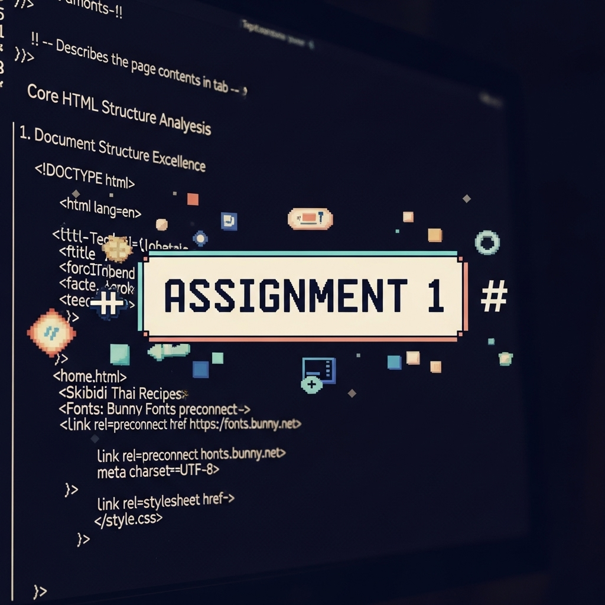
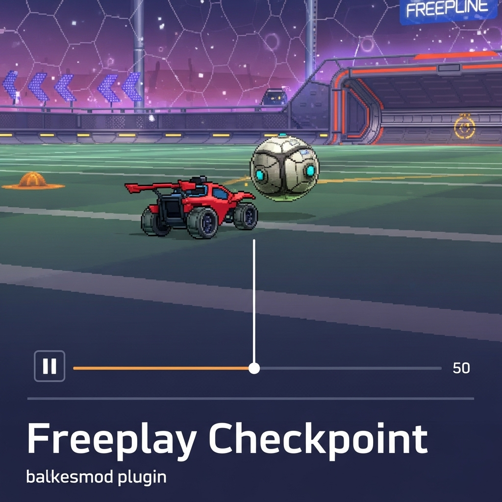

# Complete Study Guide — Building & Maintaining Your Portfolio Site  
*A step-by-step mentor walk-through for the beginning web developer*  

---

## 1 High-Level Overview
Before we dive into code, let’s celebrate the wins and outline what you’ll master by the end of this guide.

### 1.1 What You Already Achieved
* Created **four functional pages** (`index`, `projects`, `about`, `cv`).
* Implemented **navigation**, **custom fonts**, and **CSS Grid** for layout.
* Added fun, personal copy that shows personality. 🎉

### 1.2 Where We’ll Level Up
| Theme | Why It Matters |
|-------|---------------|
| **Consistency & Scalability** | A tidy codebase lets you add pages or features without pain. |
| **Semantic HTML & Accessibility** | Helps search engines *and* assistive tech understand your content. |
| **Responsive & Modern CSS** | Ensures the site looks great on any screen size. |

> Keep these themes in mind; every section of this lesson points back to them.

---

## 2 The HTML Blueprint — Structure, Semantics, Accessibility
HTML is the **skeleton**; CSS merely dresses it. A well-structured skeleton is lighter, stronger, and easier to move.

### 2.1 Document Skeleton & `<head>` Hygiene
#### 2.1.1 Problem: Duplicate `<head>` Code
Each HTML file repeats identical links to fonts and the main stylesheet:

```1:9:index.html
<link rel="stylesheet" href="style.css">
<link rel="preconnect" href="https://fonts.bunny.net">
<link href="https://fonts.bunny.net/css?family=alegreya-sans:400,400i,800,800i|pixelify-sans:400,700" rel="stylesheet" />
```

While nothing *breaks*, duplication causes:
* **Maintenance drag** – Update one link? Edit four files.
* **Performance hiccups** – Browsers re-parse the same font hints.

#### 2.1.2 Solution: One Source of Truth
If you deploy on any server-side platform (PHP, Node/Express, Django, etc.), you can extract a partial:

```html
<!-- /partials/head.html -->
<head>
  <meta charset="utf-8" />
  <meta name="viewport" content="width=device-width,initial-scale=1" />
  <title>{{ pageTitle }}</title>

  <!-- Performance boost: preload font → then stylesheet -->
  <link rel="preload" href="https://fonts.bunny.net/alegreya-sans.woff2" as="font" type="font/woff2" crossorigin>
  <link rel="stylesheet" href="/css/main.css" />
</head>
```

Then include that partial in every page template. *One edit, site-wide change.*

> ***Humor moment*** — Imagine four stage managers all shouting directions at the same time. That’s your duplicated `<head>`. Fire three, give one a coffee, and the show runs smoothly.

---

### 2.2 Semantic Grouping & Landmarks
#### 2.2.1 The Duplicate `<nav>`
Every page currently has:

```22:34:about.html
<nav>
  <ul class="nav-menu">
    <li><a href="/index.html">Home</a></li>
    …
  </ul>
</nav>
```

That’s *okay* for four pages—but imagine twenty.

#### 2.2.2 Why DRY Matters
* Less copy-paste → fewer bugs.
* Global style changes become trivial.

#### 2.2.3 Quick Fix Paths
1. **Server-Side Include** (Apache/Nginx can include raw HTML).
2. **Static-site Generators** (Eleventy, Astro) — great practice.
3. **JS Component** (if/when you add JavaScript) — `fetch('/nav.html').then(...)`.

```html
<!-- nav.html (stand-alone) -->
<nav aria-label="Main">
  <ul class="nav-menu">
    <li><a href="/">Home</a></li>
    <li><a href="/projects.html">Projects</a></li>
    <li><a href="/about.html">About</a></li>
    <li><a href="/cv.html">CV</a></li>
  </ul>
</nav>
```

Include this file wherever you like and style once in `style.css`.

---

### 2.3 `<section>` vs `<article>` — Which Tag, When?
Think of a **newspaper**:
* **Articles** = individual stories you could cut out and take home.
* **Sections** = categories like *Sports* or *Lifestyle* that group articles.

Your portfolio **project cards** can stand alone (like tiny blog posts), so wrap each in `<article>` for maximum meaning:

```html
<article class="project-card">
  <a href="https://github.com/DanIsaksson/assignment-1">
    
    <h2 class="project-title">Assignment 1</h2>
    <p class="project-blurb">Command-line tool built in C#.</p>
  </a>
</article>
```

Why this helps:
* **Search engines** can surface each project individually.
* **Screen readers** announce *Article, Assignment 1* giving clear context.

---

### 2.4 Path Correctness — Say “No” to Backslashes
Backslashes in URLs confuse non-Windows servers.

```65:66:projects.html

```

Fix:

```html

```

Also ensure your **`alt`** text is descriptive; it’s read by screen-reader users and displayed if the image fails to load.

> *Klingon road signs analogy*: People will get lost. Stick to forward slashes.

---

### 2.5 Proper List & Link Nesting
In `cv.html` you’ve nailed:

```23:29:cv.html
<ul class="contact-details">
  <li><a href="mailto:danisacsson@gmail.com">danisacsson@gmail.com</a></li>
</ul>
```

Rule of thumb:
* **`<li>` outside `<a>`** — The list item *contains* the link, not vice-versa. Nice work here!

---

### 2.6 Accessibility Essentials
1. **One `<h1>` per page.** Think chapter title. Currently some pages jump straight to `<h2>`—easy fix.
2. **Skip Link**
   ```html
   <a class="skip-link" href="#main">Skip to content</a>
   ```
   Add visually hidden styles and reveal on keyboard focus so screen-reader and keyboard users can bypass the sidebar nav.
3. **Color Contrast.** Use [WebAIM Contrast Checker](https://webaim.org/resources/contrastchecker/) to ensure lavender backgrounds vs. white text are readable (ratio ≥ 4.5:1).

---

## 3 CSS Paint & Polish — Variables, Layout, Units
Time to turn raw bones into responsive, stylish muscle.

### 3.1 Custom Properties (CSS Variables)
You’ve declared variables in `:root`—great start!

```1:14:style.css
:root {
  --hue-main: 220;
  --clr-body: hsl(var(--hue-main),10%,95%);
}
```

But then accidentally skipped the `var()` wrapper:

```16:20:style.css
body { background-color: --clr-body; /* ❌ */ }
```

**Correct Usage**

```css
body { background-color: var(--clr-body); }
```

> **How variables cascade** — If you redefine `--hue-main` inside a `.dark-theme` class, every variable referencing it updates automatically.

```css
.dark-theme { --hue-main: 320; /* purple-pink */ }
```

### 3.2 Typography Scaling with `clamp()`
#### 3.2.1 Why `clamp()`?
Without media queries you can size text responsively between a minimum and maximum:

```css
:root { --fs-hero: clamp(2.5rem, 6vw + 1rem, 6rem); }
```
* **`2.5rem`** = never shrink smaller than ~40px (assuming 16px root).
* **`6vw + 1rem`** = fluid part (6% of viewport width).
* **`6rem`** = cap at ~96px on giant monitors.

#### 3.2.2 Apply to Your Heading
```37:41:style.css
.general-container h2 { font-size: var(--fs-hero); }
```
Now the hero text scales elegantly on phones & desktops.

### 3.3 Choosing the Right Units
| Unit | Best For | Why |
|------|----------|-----|
| `rem` | Font sizes, padding, margins | Respects user’s browser zoom / base font setting. |
| `%`   | Width/height of **child** relative to **parent** | Useful when parent size is known. |
| `fr`  | CSS Grid track sizes | Divides remaining space cleanly. |
| `vw/vh` | Full viewport-based effects | Use sparingly (can break mobile address bar resize). |

> **Rule of thumb:** Pixels (`px`) are fine for hairline borders & shadows, but almost everything else should scale.

### 3.4 CSS Grid Centering: Container *vs.* Items
Your original issue: items centered, grid *container* stuck left. The fix was adding auto margins.

```css
.project-grid {
  margin-left: auto;
  margin-right: auto; /* centers the container */
}
```

If you also want items themselves centered within each grid cell:

```css
.project-grid { place-items: center; }
```

### 3.5 DRY Selectors & Utility Classes
Repeating borders across multiple classes? Bundle them.

```css
/* Utility */
.has-pixel-border {
  border: 2px solid hsl(var(--hue-main),100%,10%);
  border-radius: 15px;
}

/* Apply */
.project-card,
.profile-photo img,
.profile-photo-cv img { @extend .has-pixel-border; /* in SASS */ }
```

If you’re sticking to vanilla CSS, group selectors as shown above. Later you can migrate to a utility-first framework like Tailwind.

### 3.6 Micro-Interactions
Subtle hover effects invite exploration:

```css
.project-card {
  transition: transform .25s ease, box-shadow .25s ease;
}
.project-card:hover {
  transform: translateY(-6px) rotateZ(-0.5deg);
  box-shadow: 0 10px 20px rgba(0,0,0,.2);
}
```

> **Dark satire cameo:** Users hover, card floats—*foolish mortals*, they can’t resist clicking now…

---

## 4 Grand Synthesis — Bringing HTML + CSS Together
### 4.1 Project Architecture for Growth
* **Folder-by-feature**<br>Keep HTML, CSS (and later JS) for a component together:
  ```
  components/
    nav/
      nav.html
      nav.css
    project-card/
      card.html
      card.css
  ```
  Then roll everything up via build process (Vite, Parcel, etc.).

### 4.2 Scalability Checklist
1. **CSS Reset** – Use *Normalize.css* or a minimal reset to kill browser quirks.
2. **Naming Convention** – Try BEM:
   ```html
   <article class="project-card project-card--featured">
     <h2 class="project-card__title">…</h2>
   </article>
   ```
3. **Comment your code** — Future-you will be grateful.

### 4.3 Responsive Workflow (Mobile-First)
1. Start with a single-column layout that works on phones.
2. Add media queries *upward*.

```css
/* Base — mobile */
.project-grid { grid-template-columns: 1fr; }

@media (min-width: 600px) {
  .project-grid { grid-template-columns: repeat(auto-fill, minmax(180px, 1fr)); }
}
```

### 4.4 Move Inline Styles to CSS
Inline styles override everything else, clutter HTML, and block efficient theming. Extract them:

```html
<!-- Before -->
<span style="color:#4CAF50;">.NET</span>

<!-- After -->
<span class="tag tag--dotnet">.NET</span>
```

```css
.tag { font-weight: 600; border-radius: 4px; padding: 2px 4px; }
.tag--dotnet { color: var(--clr-dotnet); }
```

Define `--clr-dotnet` in `:root` for easy palette tweaks.

### 4.5 Performance Sprinkles
| Technique | 1-Liner Explanation |
|-----------|---------------------|
| **`preconnect`** | Opens a network connection early to your font/CDN host. |
| **`preload`** | Tells the browser “download this big image now, we’ll need it soon.” |
| **Image Formats** | WebP/AVIF shrink assets ~50% compared to JPEG. |

---

## 5 Practice & Next Steps
### 5.1 Immediate Fixes (≈ 30 min)
* Correct `var(--clr-body)` typo.
* Swap backslash image paths.
* Remove duplicate widths in `.general-container`.

### 5.2 Short-Term Enhancements (1-2 hrs)
* Extract shared `nav.html` + include everywhere.
* Implement global typography scale with `clamp()` variables.
* Add *skip link* + verify correct `<h1>` hierarchy.

### 5.3 Stretch Goals
* Build the “[Press Enter]” splash screen with minimal JS.
* Run Lighthouse + axe-core audits; aim for 90+ accessibility score.
* Integrate a build process (Eleventy or Vite) to bundle & minify assets.

### 5.4 Self-Check Quiz
1. **Explain** the difference between `<section>` and `<article>` in one sentence each.
2. Convert this pixel rule into `clamp()`:
   ```css
   .hero { font-size: 72px; }
   ```
3. Name two benefits of moving inline styles to a stylesheet.
4. Given `grid-template-columns: repeat(auto-fill,minmax(200px,1fr));`, what happens if the viewport shrinks below 200 px?

*(Answers at bottom of file – no cheating!)*

---

## 6 Reference Library
* **MDN Web Docs** – Definitive HTML & CSS info.
* **Kevin Powell YouTube** – Digestible CSS & responsive design tutorials.
* **WebAIM Contrast Checker** – Quick color-contrast validation.
* **CSS-Tricks Almanac** – “What does this property do again?”

> ***Final Humor*** — The mythical “200-year-old developer” didn’t actually live two centuries; he just spent 199 years refactoring duplicated `<head>` tags. Be smarter: refactor today, sleep tonight. ☕️

---

### Quiz Answers
1. *`<article>` is standalone; `<section>` groups related parts of something bigger.*
2. Example: `font-size: clamp(2rem, 8vw + 1rem, 4.5rem);` (Any correct clamp range earns full credit.)
3. *Cleaner HTML; easier theming; better caching; smaller diff noise.*
4. *Columns collapse to one per row; each project card becomes full-width.*

Happy coding, and see you at the next refactor!